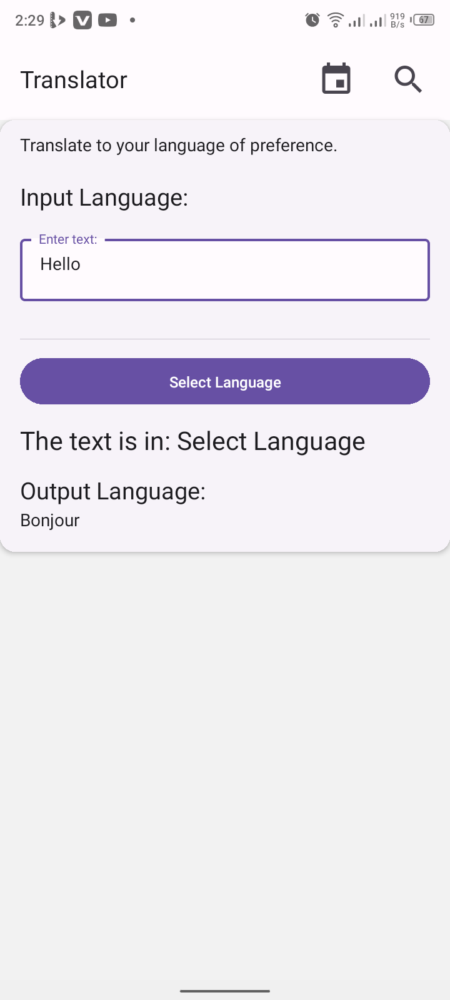

# Language Translator

[](LICENSE)  
This is a mobile app that does language translation with 106 languages all over the world. 

## 📱 Screenshots





 


## 🚀 Features

- **Feature 1** - Language translator.
- **Feature 2** - Language detector.

## 🛠️ Installation

1. **Clone this repository:**
   ```bash
   git clone https://github.com/Nic3holas-wq/all-language-translator.git
   cd all-language-translator

2. **Install dependencies**
   npm install

3. **Start the App**
   npx expo start

## 🤖 Technologies Used
1. React Native
2. Expo
3. Python

## 🎨 How It Works
Input the text to be translated on the text input provided; select the target language you're translating to; then wait for the magic to happen.

## 🙌 Contributing
Contributions are welcome! Follow these steps to contribute:

## Fork the project.
1. **Create a feature branch (git checkout -b feature/your-feature-name).**
2. **Commit your changes (git commit -m 'Add new feature').**
3. **Push to the branch (git push origin feature/your-feature-name).**
4. **Open a Pull Request.**
